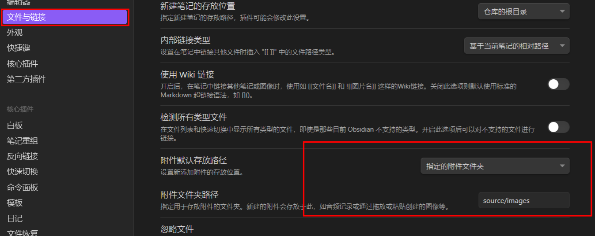
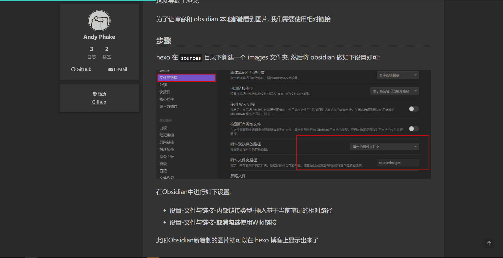

上一篇文章我们还没解决 hexo 博客的图片显示问题.

事实上 hexo 的图片显示一直是一个头疼的问题,
笔者在互联网查到了不少解决办法，但都是“相互借鉴“的多，具有实践意义的少

<!-- more -->

比如：

1.  有让安装 `hexo-asset-image` 插件的，但该插件已经”年久失修“，需要修改后使用了
2.  有让使用 hexo 官方推荐格式的:
    ```
    
    ```
    但这样写文章十分麻烦

以下是一些优质解决方案：
使用 hexo-asset-image：[Hexo 图片插入无法显示的问题 - 九月的文章](https://zhuanlan.zhihu.com/p/542101567)
与 Typora 结合的：[Hexo 发布博客的图片和公式问题 - BeWater 的文章 - 知乎](https://zhuanlan.zhihu.com/p/476601594)

但在笔者看来，使用相对链接就可以解决图片显示问题。
其他方案似乎有些舍近求远了

### 问题根源

因为 Obsidian 中默认使用的是 Wiki 链接:

```
![[Hexo + Obsidian：解决图片问题]]
```

hexo 博客里只支持 markdown 原生的图片引用格式:

```

```

这就导致了冲突.

为了让博客和 obsidian 本地都能看到图片, 我们需要使用相对链接

### 解决步骤

将 hexo 博客的根文件夹用 Obsidian 打开

在 `sources` 目录下新建一个 images 文件夹, 然后将 obsidian 做如下设置即可:



在 Obsidian 中进行如下设置：

-   设置-文件与链接-内部链接类型-插入基于当前笔记的相对路径
-   设置-文件与链接-**取消勾选**使用 Wiki 链接

此时 Obsidian 新复制的图片就可以在 hexo 博客上显示出来了


### 结语

网上大佬们的解决办法都十分折腾,
笔者不知道为什么不使用如此简单的方法.
如果读者对此了解, 还望不吝赐教.

笔者的博客: [Blog](https://phakeandy.github.io/)
